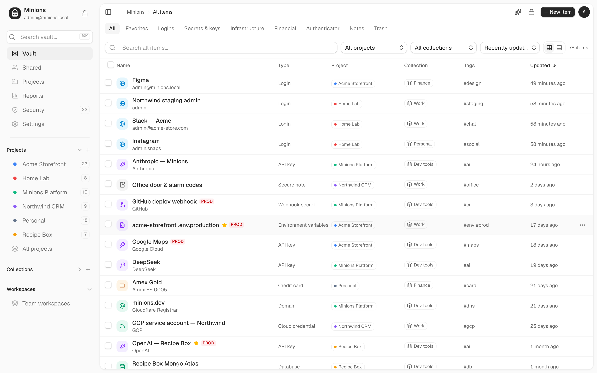
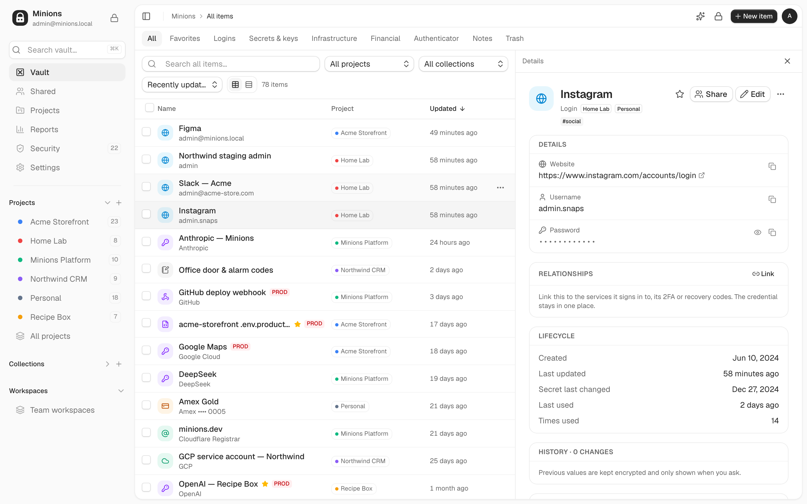
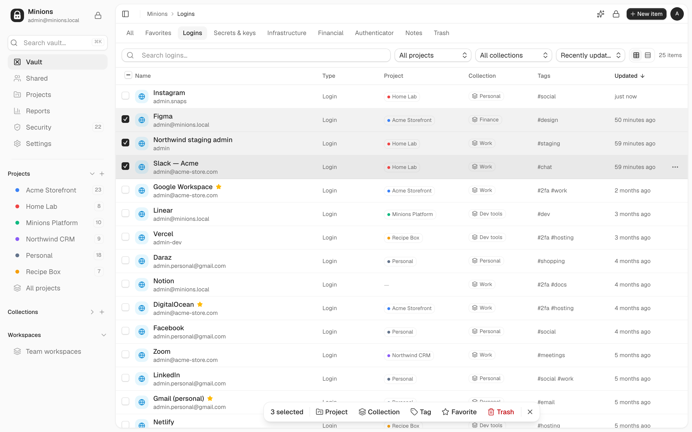
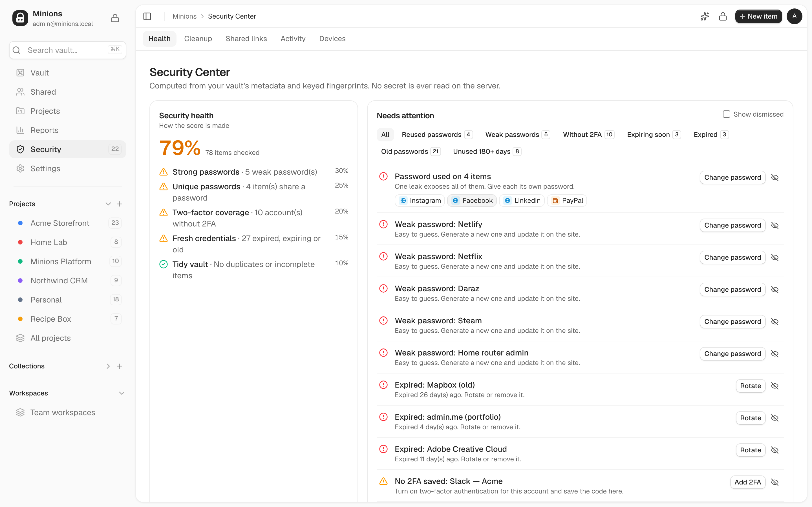
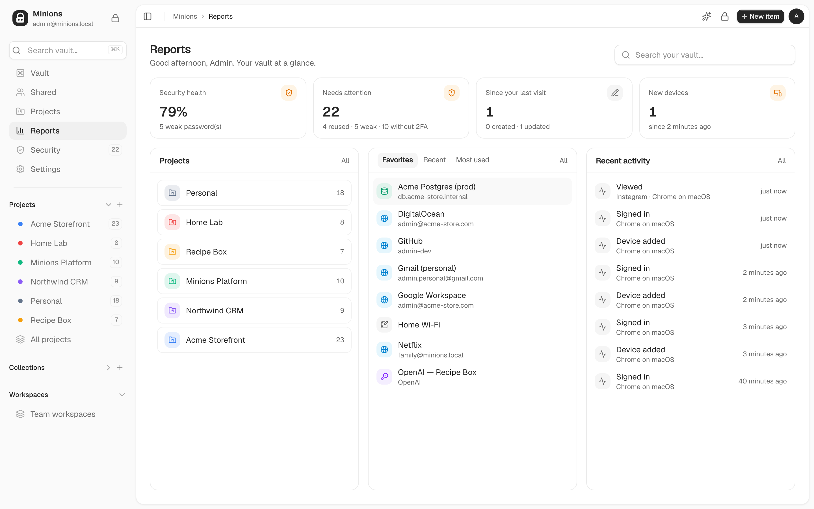
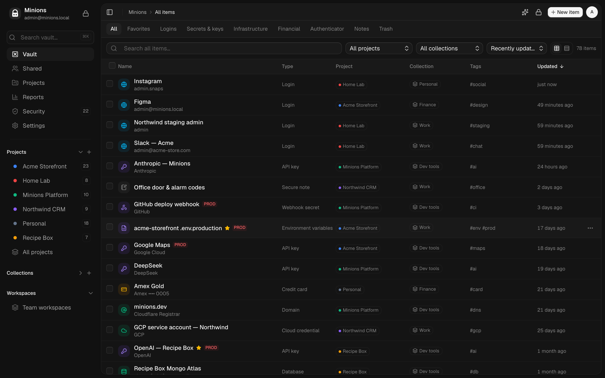
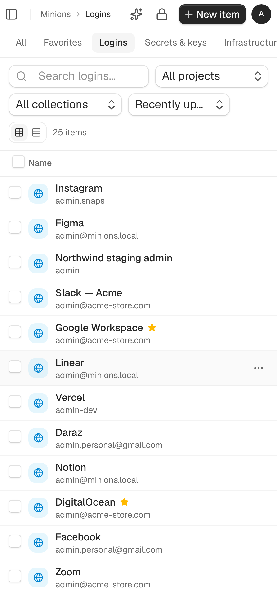

<div align="center">


# Minions

**An open-source, self-hosted, end-to-end encrypted password manager and secrets vault.**

Passwords, API keys, `.env` files, SSH keys, server and database credentials, 2FA codes,
cards, bank accounts, licenses and private notes, all in one place. Everything is
encrypted on your device before it reaches the server.

[](LICENSE)


[Features](#features) · [Screenshots](#screenshots) · [How the encryption works](#how-the-encryption-works) · [Quick start](#quick-start) · [Self-hosting](#self-hosting) · [FAQ](#faq) · [Contributing](#contributing)



</div>

## Why Minions

Most people keep secrets in too many places: a password manager for logins, a notes app
for Wi-Fi and alarm codes, `.env` files on a laptop, API keys in chat history, 2FA codes
on one phone. Minions puts all of it in **one encrypted vault that you can run yourself**,
and organizes it the way you work: by project, by collection and by tag.

- **Private by design.** Your master password never leaves your device. The server
  stores only ciphertext for secrets and cannot decrypt your vault.
- **Built for real life and for developers.** Logins and cards sit next to API keys,
  servers, databases, SSH keys, webhooks, domains and whole `.env` files.
- **Yours to run.** Self-host it with Docker on your own server. The code is AGPL-3.0,
  so it stays open.

## Features

### Vault
- **Every kind of secret:** logins, API keys, secrets, environment variables (paste a
  `.env`), servers, SSH keys, databases, cloud credentials, webhooks, domains, credit
  cards (only the last 4 digits are visible to the server), bank and payment accounts,
  licenses, recovery codes, 2FA secrets and secure notes.
- **Paste anything:** paste a site, email and password, `label: value` lines, a `.env`, card
  details or a 2FA QR screenshot, and the right fields are filled in on your device.
- **Table and list views** with sorting, plus filters by project, collection, tag and type.
- **Organize fast:** tick items and move them to a project or collection, tag them, star
  them or trash them in bulk, or drag them onto a project in the sidebar. Every move can be undone.
- **Projects** group what one product or client depends on (accounts, APIs, servers,
  environments, notes). One credential can belong to one project and be used by several.
- **Version history** for every change, kept encrypted.
- **Relationships:** link a domain or server to the login it uses instead of copying the password.

### Security
- **End-to-end encryption** with Argon2id and AES-256-GCM ([details below](#how-the-encryption-works)).
- **Security Center:** weak, reused, old and expired passwords, accounts without 2FA,
  duplicates, with an explainable health score.
- **Built-in authenticator:** live TOTP codes, QR import (including Google Authenticator's export).
- **Account protection:** two-factor sign-in (TOTP and recovery codes), passkeys (Windows
  Hello, Touch ID, phone or security key), auto-lock, device and session management,
  "lock all devices", and a full activity log.
- **Vault-key rotation** that re-encrypts everything on your device.

### Sharing
- **Share with people** by email. Each shared item gets its own key, sealed to the
  recipient's public key, with optional expiry and view or edit permission.
- **Team workspaces** with members, roles, per-item access and key rotation when someone leaves.
- **One-time share links** with view limits, expiry and an optional passphrase.

### Apps and import
- **Web app** for desktop and mobile browsers, with light and dark themes.
- **Chrome extension** (Manifest V3): "Sign in with Minions app" connects it to the web app
  with one click, with no password to type, and it stays signed in. It fills logins on matching
  sites, offers to save new logins, shows every 2FA code live, and includes item details,
  favorites and a password generator. Site matching is phishing-resistant.
- **Desktop app** (Tauri 2) with a Windows installer.
- **Import** from Bitwarden (CSV/JSON), Chrome, Edge, Firefox, Notion (CSV export) and
  generic CSV/JSON, with a preview and duplicate detection.
- **Encrypted backups** that only your master password can open, and restore.
- **Optional AI organizing** (DeepSeek) suggests projects, collections and tags from names
  and websites only. Secrets and financial items are never sent. Off unless you add an API key.

## Screenshots

| Item details | Bulk move to a project or collection |
|---|---|
|  |  |

| Security Center | Reports |
|---|---|
|  |  |

| Dark mode | Mobile |
|---|---|
|  |  |

*All screenshots use generated demo data.*

## How the encryption works

```
master password ──Argon2id (64 MiB, t=3)──► master key            (never leaves your device)
master key ──HKDF──► auth key        → sent at sign-in; the server stores only Argon2id(auth key)
master key ──HKDF──► encryption key  → unwraps your user key, which unwraps your vault key
vault key  ──AES-256-GCM──► every secret field and note body, bound to its item and field
```

- The server **never receives** your master password or any key that can decrypt your vault.
- Secrets, card numbers, private keys, `.env` values and note bodies are stored as
  **ciphertext only**. The API refuses a sensitive field that is not encrypted, so even a
  buggy client cannot save a plaintext secret.
- Keys live **only in memory**; locking or reloading wipes them.
- **Honest limits:** some metadata stays readable to the server so search and the Security
  Center work (item names, usernames, hosts, projects, tags, dates). A server that is
  actively compromised could serve a modified web app. The browser extension and desktop
  app are packaged, so they are not affected by that. The full analysis is in
  [THREAT_MODEL.md](THREAT_MODEL.md).

Read more: [ARCHITECTURE.md](ARCHITECTURE.md) (design and encryption boundaries) ·
[SECURITY.md](SECURITY.md) (each requirement with its tests) ·
[THREAT_MODEL.md](THREAT_MODEL.md) (attackers, mitigations, residual risks).

> Minions has had an internal security review, documented in the threat model, but **no
> independent third-party audit yet**. Please keep your own encrypted backups.

## Quick start

Requirements: **Node 22.12+**, **pnpm 11**, **Docker**. Rust is needed only for the desktop app.

```bash
git clone https://github.com/shimentosh/minions.git
cd minions
pnpm install
pnpm db:up                                  # PostgreSQL on :55440
pnpm mail:up                                # Mailpit, inbox at http://localhost:58025
cp apps/api/.env.example apps/api/.env      # then fill SERVER_ENCRYPTION_KEY and PRELOGIN_SECRET
cp apps/web/.env.example apps/web/.env
pnpm --filter @minions/core build
pnpm --filter @minions/api db:deploy        # apply migrations
pnpm dev                                    # API on :4600, web on :5180
```

Generate the two server keys with:

```bash
node -e "console.log(require('crypto').randomBytes(32).toString('base64'))"
```

Open http://localhost:5180, create a vault, then optionally fill it with demo data:

```bash
MINIONS_EMAIL=you@example.com MINIONS_PASSWORD='your master password' pnpm seed:demo
```

- **Email:** in development, verification links go to Mailpit at http://localhost:58025.
  In production, set `RESEND_API_KEY` and `MAIL_FROM` to send through
  [Resend](https://resend.com).
- **AI suggestions:** set `DEEPSEEK_API_KEY`. Without it, rules and your own habits are used.
- **Chrome extension:** `MINIONS_WEB_URL=https://vault.example.com pnpm --filter @minions/extension build`,
  then chrome://extensions → Developer mode → Load unpacked → `apps/extension/dist`. The API is
  taken to be at `<web>/api` (as the production image serves it); set `MINIONS_API_URL` if not.
  Without `MINIONS_WEB_URL` it builds for the local dev servers.
- **Desktop:** `pnpm --filter @minions/desktop dev` runs the web app inside a Tauri window.
  For a different API origin, update `connect-src` in `apps/desktop/src-tauri/tauri.conf.json`.

## Self-hosting

[docker-compose.prod.yml](docker-compose.prod.yml) builds two services:

- `web`: nginx serving the app and proxying `/api/*` to the API. This is the only public
  service; point your domain at it (container port 80).
- `api`: applies database migrations on start.

PostgreSQL 17 and Redis 7 run as separate services; set `DATABASE_URL` and `REDIS_URL`.
The required variables are marked `:?` in the compose file. **Before going live, read the
production checklist in [SECURITY.md](SECURITY.md#deployment-requirements).** The API refuses
to start with development defaults such as http origins or a reused server key.

## Project structure

```
apps/api         NestJS 11 + Prisma 7 + PostgreSQL 17
apps/web         Vite + React 19 + TanStack Router/Query + Tailwind v4
apps/extension   Chrome MV3 extension (esbuild)
apps/desktop     Tauri 2 shell around the web build
packages/core    Crypto, item types, TOTP, generator, detection, classification, import parsers
tests/e2e        Browser tests for the web app, extension and desktop app (Playwright)
```

## Testing

```bash
pnpm --filter @minions/core test     # crypto, TOTP vectors, detection, classification, imports
pnpm --filter @minions/api test      # integration tests against minions_test (created automatically)
pnpm typecheck
pnpm lint
node tests/e2e/smoke.mjs             # needs `pnpm dev` running
pnpm --filter @minions/extension build && node tests/e2e/extension.mjs
```

What is built, what is still open, and guides for team workspaces and the operator
dashboard: [docs/STATUS.md](docs/STATUS.md).

## FAQ

**Is Minions free?**
Yes. It is free and open-source under the AGPL-3.0 license. You run it on your own server.

**Is it an alternative to Bitwarden, 1Password, LastPass or KeePass?**
It covers the same everyday needs (encrypted logins, autofill, 2FA codes, sharing, import
from Bitwarden and browsers) and adds a vault for developer secrets: API keys, `.env`
files, servers, databases and SSH keys, organized by project. Unlike KeePass, it syncs
through your own server and works in the browser.

**Can the server owner read my passwords?**
No. Secrets are encrypted on your device with keys derived from your master password,
which is never sent. The server can see some metadata, such as item names and websites;
see [what the server can see](ARCHITECTURE.md#what-the-server-can-see-safe-metadata).

**What happens if I forget my master password?**
Your vault cannot be recovered, not even by the server owner. That is the price of
end-to-end encryption. Keep an encrypted backup (Settings → Backup & recovery) and store
your master password somewhere safe.

**Does the AI see my passwords?**
No. AI organizing is optional and off without an API key. It only receives names and
websites; card, bank and other financial items are never sent. Every payload is checked for
secret-shaped text before sending, and tests verify this.

**Can I use it with a team?**
Yes. Team workspaces have members, roles and per-item access, and you can also share
single items with people by email.

## Contributing

Contributions are welcome: bug reports, features, translations, docs and security research.

- Read [CONTRIBUTING.md](CONTRIBUTING.md) to set up and open a pull request.
- Found a vulnerability? **Please do not open a public issue.** Follow the
  [security policy](.github/SECURITY.md) to report it privately.
- Be kind: [Code of Conduct](CODE_OF_CONDUCT.md).

If Minions is useful to you, **give it a ⭐**. It helps other people find it.

## License

[GNU Affero General Public License v3.0](LICENSE). You may use, modify and self-host Minions.
If you run a modified version as a service for others, you must publish your changes
under the same license.
